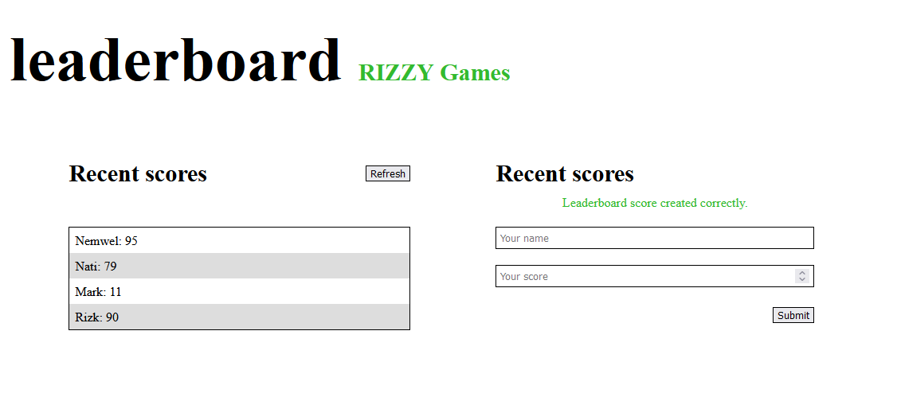

# Leaderboard

> A simple design for a leaderboard list. All data are stored on Leaderboard API. Upon page load, List of scores get updated from the API. Upon submitting names and scores, names are added to the list of game scores on the API. Upon clicking refresh, list of names are updated and displayed.

## Screensot

## Built With

- HTML
- css
- JS
- Webpack
- Restful API 

## Live Demo (if available)

Check the [Live Demo](https://elerqsousy.github.io/leaderboard-api/) deployed on github pages.

## Getting Started

This is a simple static website made with HTML5, CSS, and JavaScript. There is no specific requirements for building the project.
## Setup
- clone the repo locally 
### Install
- run "npm install" to install dependencies.
- run "npm start" to run local live host.
- run "npm run build" to bundle dist files.
## Authors

👤 **Mahmoud Rizk**

- GitHub: [@Elerqsousy](https://github.com/Elerqsousy)

## Credits
Loading animation is an edited version of [Tatsuya Azegami](https://codepen.io/42EG4M1)'s [animation](https://codepen.io/42EG4M1/pen/bVMzze).
## 🤝 Contributing

Contributions, issues, and feature requests are welcome!

Feel free to check the [issues page](../../issues/).

## Show your support

Give a ⭐️ if you like this project!

## 📝 License

This project is [MIT](./MIT.md) licensed.
